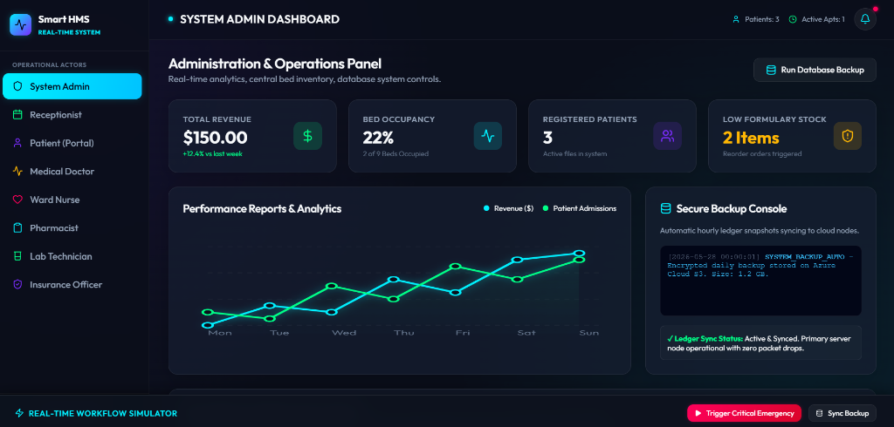
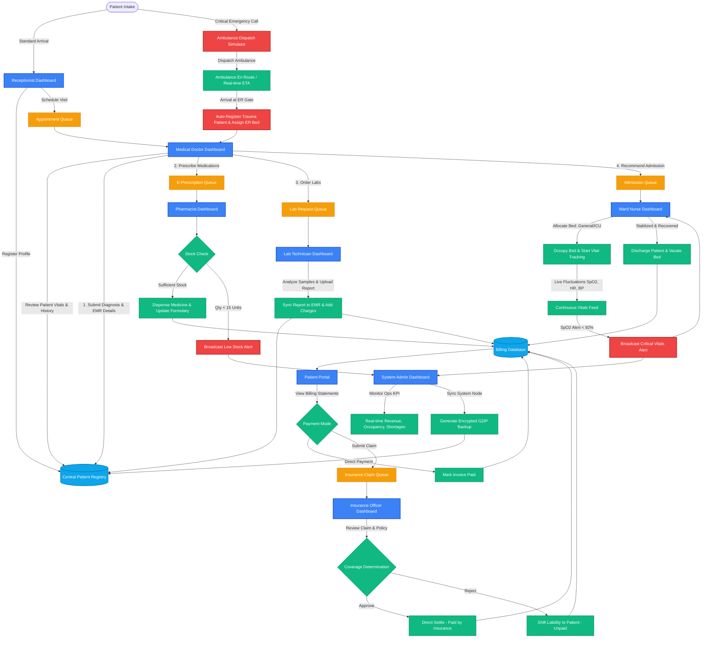
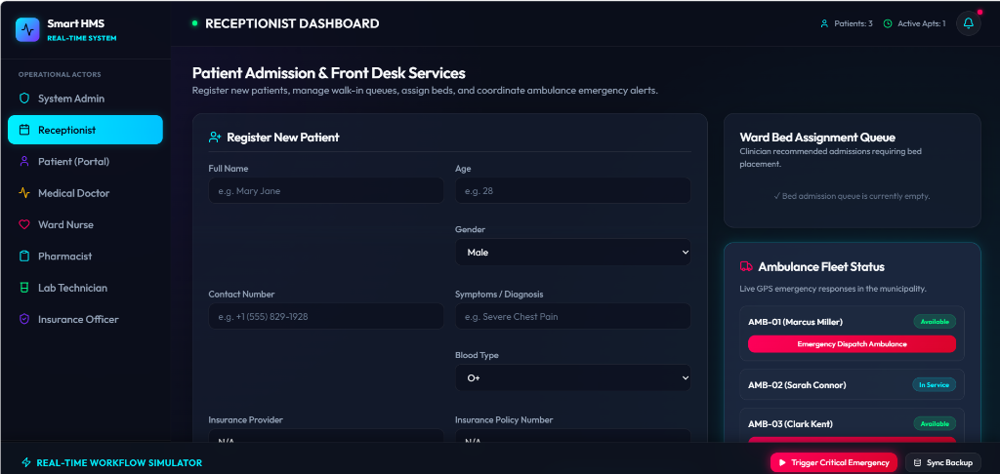
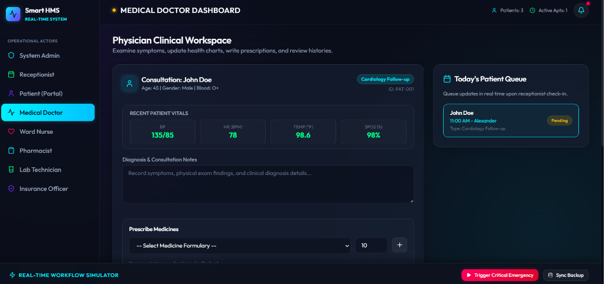
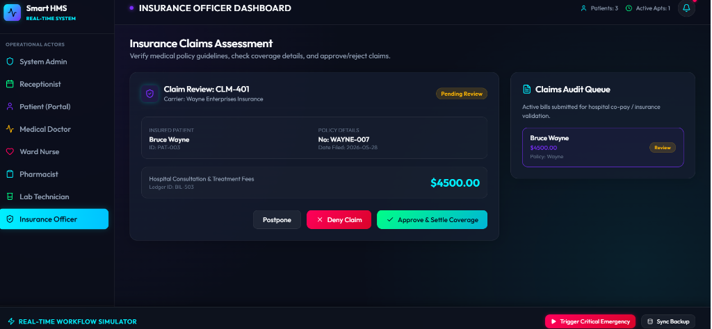
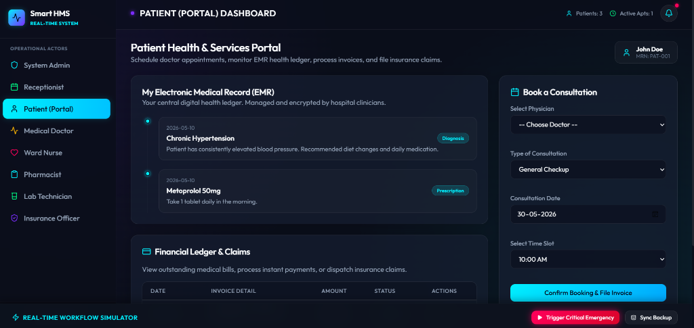

# 🏥 Smart Hospital Management System (HMS)

Smart HMS is a real-time, role-based healthcare operations dashboard and clinical management system. Built using a modern React & Vite architecture and custom CSS styling, it provides a simulation of real-time patient care, clinical workflows, and administrative logistics.

---

## 🗺️ Overall System Workflow Diagram

The system coordinates interactions across **8 operational actors**, orchestrating clinical care, laboratory investigations, pharmacy inventory, ward management, billing, and insurance processing.

---

## ✨ Core Features & Roles

The system is split into specialized views, each tailored to specific hospital roles:

### 1. 🛡️ System Administrator
* **KPI Operational Stats**: Live overview of hospital financials (total revenue), bed occupancy rate, active outpatient consultations, and low pharmacy stock levels.
* **Encrypted Database Backups**: Trigger manual snapshots of the centralized database. It tracks historical backup logs with detailed metrics (time, patients, appointments, and beds).
* **Low Stock Broadcaster**: Receives real-time warnings from the pharmacy regarding inventory shortages.

### 2. 📅 Receptionist
* **Patient Registration**: Profile builder capturing name, age, gender, contact info, blood type, and insurance credentials.
* **Scheduling Engine**: Real-time appointment builder linking registered patients with specialized doctors, dates, times, and consultation types.
* **Consultation Billing**: Automatically flags initial consultation invoices in the patient’s invoice records.

### 3. 🩺 Medical Doctor
* **Electronic Medical Records (EMR)**: Access to clinical history, past diagnoses, treatment timelines, and diagnostic reports.
* **Diagnostics Order**: Instantly request laboratory workups (e.g., Complete Blood Count, Brain MRI) routed to the Lab Technician.
* **E-Prescribing**: Order medications directly to the Pharmacy Formulary with quantity requirements.
* **Admission Referral**: Direct orders to admit unstable patients, transferring them to the Nurse ward queue.

### 4. 🛏️ Ward Nurse
* **Bed Management**: Graphic visual layout of General Ward, ICU, and ER beds (Available vs Occupied).
* **Admission Allocation**: Assign patients recommended for admission to available beds, dynamically adding daily room charges to their bills.
* **Patient Discharge**: Complete patient discharge protocols, vacating beds in real-time.
* **Live Vitals Tracking**: Updates, monitors, and processes patient blood pressure, heart rate, temperature, and SpO2 levels.

### 5. 💊 Pharmacist
* **Formulary Inventory Manager**: Real-time tracking of medicine stock levels (Amoxicillin, Metoprolol, Atorvastatin, etc.).
* **Prescription Dispatch**: Review, verify, and dispense incoming prescriptions, automatically subtracting stock quantities.
* **Automated Low-Stock Trigger**: Warns the system if any drug count drops below 15 units.
* **Restock Protocol**: Reorder and restock items to maintain formulary supply levels.

### 6. 🔬 Lab Technician
* **Lab Work Orders**: Centralized queue showing test requests ordered by medical doctors.
* **Lab Report Publisher**: Process diagnostic tests, upload findings, write reports, and sync results back to the patient’s EMR.
* **Automatic Billing Sync**: Appends corresponding laboratory diagnostic charges to the patient’s ledger.

### 7. 💼 Insurance Officer
* **Claim Assessment**: Review insurance claims submitted by patients, checking the patient’s policy details, provider name, and claim amount.
* **Coverage Processing**: Approve or reject claims in a single click, instantly updating the patient's billing status.

### 8. 👤 Patient Portal
* **EMR Portal**: Self-service portal where patients view their diagnosis timeline, prescriptions, and laboratory reports.
* **Billing Desk**: View and track billing details (consultations, ward fees, lab work, pharmacy costs).
* **Payment Processing**: Settle bills directly or file claims to their designated insurance provider.

---

## ⚡ Real-Time Simulation Engine

The application incorporates a background simulation layer to demonstrate system interactivity without a backend database:

1. **Ambulance Dispatch & Triage Simulator**:
   * Simulates emergency calls dispatching an ambulance (lights & sirens active).
   * Real-time GPS travel tracking computes ETA and progress indicators.
   * Upon arrival, it registers a dummy patient record (Trauma Victim) and assigns them to an Emergency ER Bay.

2. **Fluctuating Inpatient Vitals**:
   * Background timers apply minor fluctuations to vital signs (heart rate, temperature, blood pressure) for admitted patients.
   * Prompts visual changes on the Nurse Dashboard when metrics fluctuate.

3. **Vital Signs & Stock Alerts**:
   * Generates critical alerts (e.g., SpO2 drops below 92%) with live desktop toast notifications.
   * Monitors drug inventories and generates low-stock warning banners.

---

## 🛠️ Technology Stack

* **Frontend Library**: React (v19)
* **Build Tooling & Server**: Vite (v8)
* **Icons Library**: Lucide React
* **Styling**: Pure CSS (utilizing variable tokens, responsive layouts, glassmorphism UI elements, and custom micro-animations)

---

